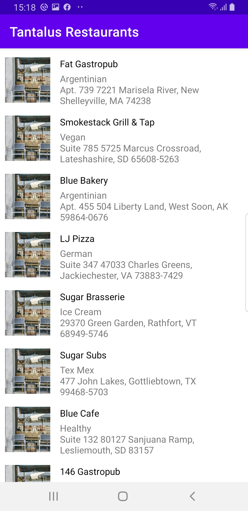

# Tantalus-Restaurants
App that presents a list of restaurants

## The Brief

App that fetches data from a REST API using Retrofit, cache this data for offline use in an SQLite database 

## Architecture & Libraries
    - MVVM
    - Retrofit
    - ROOM Database
    - Dependency Injection - Dagger-Hilt
    - Kotlin Coroutines
    - Offline Cache
    - Flow
    - NetworkBoundResource

## App preview:

Image #1            
:-------------------------:
   

